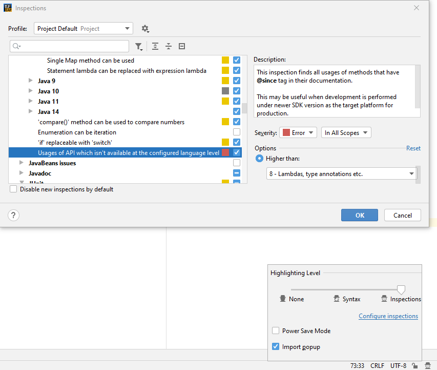

# Kala Retro8 - use modern Java 9+ syntax and JPMS when targeting Java 8

> Make Java 8 Great Again.

**The plugin has been submitted and is waiting for gradle official approval, please wait a few days.**

Kala retro8 is a gradle plugin, Kala retro8 is a gradle plugin. 
It is used to support the use of Java 9 and later syntax in Java 8.

It is also used for modular Java 8 libraries. Through this plugin, 
you can easily use JPMS (Java Platform Module System) in Java 8 just like Java 9.

## How does it work?

The plugin enables new syntax support through [Jabel](https://github.com/bsideup/jabel).

> Jabel is a javac compiler plugin, it instruments the java compiler classes 
and makes it treat some new Java 9+ languages features as they were supported 
in Java 8.
> 
> As was previously described, Jabel makes the compiler think that certain features were developed for Java 8, 
and removes the checks that otherwise will report them as invalid for the target.
> 
> It is important to understand that it will use the same desugaring code as for Java 9+ but won't change the result's 
classfile version, because the compilation phase will be done with Java 8 target.

However, Jabel cannot handle JPMS well. This plugin solves this problem.

This plugin will specify the target version of the compiler as 9, 
and then process class files other than `module-info.class` to make them
compatible with Java 8. 

Java 9 does not generate bytecode that is not supported 
by JVMs 1.8, so it is safe to do so.

Through this approach, Kala retro8 has the best compatibility with JPMS,
which is the same as when using Java 9.

## How to avoid using Java 9+ APIs in IntelliJ IDEA?

By Jabel documents:

> If you set `--release=8` flag, the compiler will report usages of APIs that were not in Java 8 (e.g. `StackWalker`). But if you wish to see such usages while editing the code, you can make IDEA highlight them for you:
> 
> * On the bottom right click on the head with the hat
> * Click on "Configure inspections"
> * Find "Usages of API which isn't available at the configured language level"
> * Click "Higher than", and select "8 - Lambdas, type annotations etc." from dropdown
> 
> 

## Usage

You just need to apply the plugin like this,
the plugin has handled everything for you behind the scenes.

```groovy
plugins {
  id "org.glavo.kala-retro8" version "1.0.0"
}
```

Kotlin DSL:
```kotlin
plugins {
  id("org.glavo.kala-retro8") version "1.0.0"
}
```

Of course, you can remind the IDE to enable the corresponding 
syntax support through `sourceCompatibility`:

```groovy
sourceCompatibility = "17"
```

Kotlin DSL:
```kotlin
tasks.compileJava {
    sourceCompatibility = "17"
}
```

To start modularization support, 
you only need to use Gradle's `inferModulePath` property:

```groovy
java {
    modularity.inferModulePath.set(true)
}
```

Kotlin DSL:
```kotlin
tasks.compileJava {
    modularity.inferModulePath.set(true)
}
```

For more details, see [Jabel - use modern Java 9-14 syntax when targeting Java 8](https://github.com/bsideup/jabel).